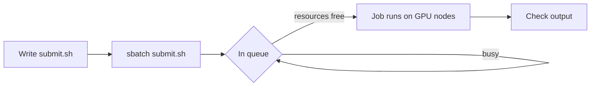

# LUMI AIF Learning Template

This is the official template for creating clean, branded self-learning course sites. By using this template, you ensure that your training materials match the **LUMI AI Factory** visual identity automatically.

For a quick overview of the Markdown syntax, see the [Markdown Cheat Sheet](https://www.markdownguide.org/cheat-sheet/).

## Add more pages
1. **Create a new page:** `index.md` is the 'landing page' of the website, do not rename it. You can add more pages by dropping new `.md` files into `content/` (or a subfolder). To remove the example chapters, delete `content/chapter1.md` and `content/chapter1-1.md`.
2. **Add front matter.** Every page needs these lines at the top:

```markdown
---
title: "Home"
nav_order: 1
---
```

Where:
- `title` is the name shown in the sidebar and the browser tab.
- `nav_order` controls the order pages appear in the sidebar.
- `parent` (optional) groups a page underneath a chapter. See `content/chapter1.md` for an example.

3. **Add subpages.** You can add subpages either by creating separate `.md` files or by appending new front matter blocks to existing files. See [Chapter 1](/chapter1) for a full guide on both methods.

## Branded callout boxes

Use callout boxes to highlight information for your students. Just start a blockquote with `[!type]` and optionally a custom title. The next line or lines are the main content of the callout box.

> [!note] LUMI Purple: Note
> Use this for additional context or general helpful information.

> [!warning] LUMI Magenta: Warning
> Use this for critical warnings, security notices, or common errors to avoid.

> [!info] Light Blue: Info
> Use this for neutral side-notes, references, or background information.

> [!tip] Deep Blue: Tip
> Use this for pro-tips, shortcuts, or recommended best practices.


The `command` callout renders a copyable terminal command:

> [!command]
> srun --pty bash

Make sure to leave an empty line before and after each callout.

## Technical content

- **Links** turn magenta on hover.
- **Inline commands**: use backticks to show code like `srun --pty bash`.
- **Code blocks**: triple backticks render syntax-highlighted blocks with a copy button in the top-right corner. Always leave an empty line before and after the block:

```python
import math

result = math.sqrt(25)
print(f"The calculation result is: {result}")
```

You can optionally label a code block with a filename, which is handy when the snippet belongs to a specific script. Just add `title="..."` after the language:

```python title="train.py"
import torch
model = torch.nn.Linear(10, 1)
```

- **Terminal blocks**: tag a code block with `bash`, `shell`, `zsh`, or `console` and it renders as an Ubuntu styled terminal window with a `user@lumi:~$` prompt on every line. The copy button only copies the actual commands, not the prompt, so students can paste straight into their shell:

```bash
module purge
module use /appl/local/laifs/modules
module load lumi-aif-singularity-bindings
```

- **Shell scripts**: tag a code block with `sh` and it renders as a nano editor window instead: a file being edited, with no `user@lumi:~$` prompt. Use this for `.sh` scripts students save and run, rather than commands typed live:

```sh title="submit.sh"
#!/bin/bash
#SBATCH --partition=standard-g
#SBATCH --nodes=1

srun python train.py
```

## Quizzes

Tag a code block with `quiz` to turn it into an interactive multiple-choice box in LUMI colours. Readers pick an answer, instantly see whether they were right (and which option was correct), read an optional explanation, then click **Next question** to move on. A running score appears once every question is answered.

One `quiz` block can hold several questions, separated by a line of `---`. Mark answers with Markdown checkboxes: `[x]` for correct, `[ ]` for wrong. Start each question with `Q:`, add an optional `title:` line at the top, and an optional explanation line starting with `>`:

````text
```quiz
title: Check your understanding

Q: Which workload manager does LUMI use?
- [ ] PBS
- [x] Slurm
- [ ] LSF
> LUMI runs all batch jobs through the Slurm workload manager.

---

Q: Which of these are valid GPU partitions? (select all)
- [x] standard-g
- [x] small-g
- [ ] turbo-x
> standard-g and small-g exist; turbo-x is made up.
```
````

- A question with a single `[x]` reveals feedback as soon as the reader clicks an option.
- A question with **two or more** `[x]` answers becomes a "select all that apply" question: the reader ticks several boxes, then clicks **Check answer**.

And here is exactly that example, live. Try answering it:

```quiz
title: Check your understanding

Q: Which workload manager does LUMI use?
- [ ] PBS
- [x] Slurm
- [ ] LSF
> LUMI runs all batch jobs through the Slurm workload manager.

---

Q: Which of these are valid GPU partitions? (select all)
- [x] standard-g
- [x] small-g
- [ ] turbo-x
> standard-g and small-g exist; turbo-x is made up.
```

See [Chapter 1](/chapter1) for another example in context.

## Hiding content behind a click

Wrap anything in `<details>` to collapse it, and put the clickable title in `<summary>`. This is handy for exercise solutions, long log output, or optional deep-dives that would otherwise interrupt the page. Leave an empty line after the `<summary>` line and before the closing `</details>`, otherwise the content inside is not treated as Markdown:

<details>
<summary>Show the solution</summary>

Submit the job and check the queue:

```bash
sbatch submit.sh
squeue --me
```

</details>

Anything can go inside: callouts, code blocks, images, tables, quizzes, even another collapsible section. Add `open` (`<details open>`) to start expanded. Writing the title as a heading (`<summary>### Exercise 1</summary>`) sizes it like a normal `###` heading and lists it in the table of contents on the right:

<details>
<summary>### Exercise 1: submitting a job</summary>

Write a `submit.sh` script that runs `train.py` on one GPU node.

</details>

## Embedding pictures

Drop your image in the `public/assets/` folder of the repository, then reference it from any `.md` file using the `./assets/...` form as such:


Images are clickable and can be opened full-screen. 

(Optional) For a captioned, resized image, use HTML directly inside your markdown. Use a percentage width (`%`) so the image scales with the text column and looks the same on every screen:

<figure>
  
  <figcaption><em>Figure 1: LUMI data center visual from the LUMI brand guide.</em></figcaption>
</figure>

## Offering files for download

To let readers download a file (a notebook, dataset, script, or archive), drop it in the same `public/assets/` folder and link to it with the `./assets/...` form, just like an image. Any target that is not an image or another page renders as a download button showing the file name and type:

[Example notebook](./assets/hello-world.ipynb)

Leave the link text empty to label the button with the file name itself:

[](./assets/hello-world.ipynb)

Either way, clicking saves the file under its original name.

## Embedding YouTube videos

To add a video, simply copy the **Embed code** from YouTube (Share > Embed) and paste it into the `.md` file:

<iframe width="560" height="315" src="https://www.youtube.com/embed/aLae9Sd2oos?si=uJ_6ccR3ArrpVXqT" title="YouTube video player" frameborder="0" allow="accelerometer; autoplay; clipboard-write; encrypted-media; gyroscope; picture-in-picture; web-share" referrerpolicy="strict-origin-when-cross-origin" allowfullscreen></iframe>

## Tables

Tables can be added with this syntax:

| Nodes | CPUs             | CPU cores  | Memory   |
|:------|:-----------------|:-----------|:---------|
| 1888  | 2x AMD EPYC 7763 | 128 (2x64) | 256 GiB  |
| 128   | 2x AMD EPYC 7763 | 128 (2x64) | 512 GiB  |
| 32    | 2x AMD EPYC 7763 | 128 (2x64) | 1024 GiB |

(The vertical lines don't necessarily need to align perfectly in terms of spaces between them. AI can help you in converting your material to a table like this)

Always leave an empty line before and after the table.

## Mathematical formulas

Write LaTeX formulas using KaTeX. Use single dollar signs for inline math and double dollar signs for block math.

- **Inline math:** $E = mc^2$
- **Block math:**

$$
\nabla \times \mathbf{E} = -\frac{\partial \mathbf{B}}{\partial t}
$$

$$
\int_{-\infty}^{\infty} e^{-x^2}\, dx = \sqrt{\pi}
$$

## Diagrams

Tag a code block with `mermaid` to render a [Mermaid](https://mermaid.js.org/) diagram in LUMI colours. Flowcharts, sequence diagrams, pie charts, Gantt charts, state diagrams and the other Mermaid diagram types all work, and the colours follow the light/dark theme automatically:

````text

````

And here is that example, live:


See the [Mermaid documentation](https://mermaid.js.org/intro/) for the syntax of every diagram type.

## Section links and table of contents

Every heading on the page automatically gets a copy-link icon next to it on hover. Clicking it copies a deep link to that section to your clipboard. The table of contents on the right tracks your scroll position and updates the URL link live, so the link you share always points to whatever the reader is currently looking at.

## Glossary & hover definitions

The [Glossary](/glossary) page is a normal `.md` file that lives right next to `index.md` and the chapter files in the `content/` folder. It **must be named exactly `glossary.md`** (all lowercase) and needs the same front matter as any other page. The first `| Term | Definition |` table in that file is automatically parsed into the glossary.

Once a term is defined there, you can reference it anywhere by putting a single percent sign directly after the word. The reader sees a dashed underline and gets the definition in a pop-up on hover. Try it here: you write everything in Markdown%, every page starts with Front Matter%, and you highlight things with a Callout%.

- Type the term and add a percent sign right after it, with no space: Markdown%.
- Matching is case-insensitive, so markdown% also works.
- Multi-word terms work too. Put the percent sign after the last word: Front Matter%.
- Plural forms are also recognised: if the glossary defines **Front Matter**, then Front Matters% works just as well. Even back-ticked code terms work: `Front Matters%` is recognised too.
- The percent sign can go inside *or* outside any inline formatting, so `Front Matter%` and `Front Matter`% both work, as do *Front Matter%* and *Front Matter*%.
- A word that isn't in the glossary table is left exactly as you typed it, so ordinary percent signs are never affected.

See the [Glossary](/glossary) page for the term table you edit.

## Jupyter notebooks as pages

If your material is already written as Jupyter notebooks, you do not have to rewrite it in Markdown. Drop the `.ipynb` files into `content/` and each one becomes a page, exactly as a `.md` file does. [Chapter 2](/03_notebook_example) is a notebook, and explains the rest.

## Need help?

If you have ideas on how to make this template even better, I’d love to hear them! Send me an email at `name.surname@csc.fi` where name is Artur and surname is Vojt-Antal (anti-spam measure).
